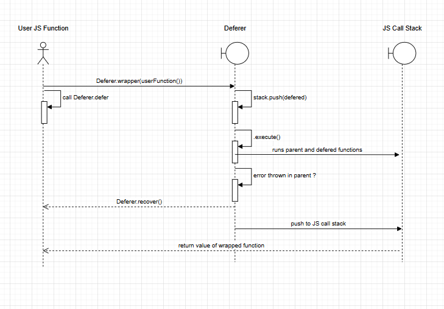

# defer-node-js

Defer and recover for JavaScript and TypeScript, inspired by Golang. defer lets you schedule cleanup functions to run after a parent function exits, ensuring efficient resource management. recover helps handle errors gracefully, making them ideal for robust error handling and resource cleanup in complex workflows.

## install

```
npm i defer-node-js
```

## Introduction

In go, the defer keyword schedules a function call to be run when the parent exit. Weather by reaching the end of the funciton or by a panic. The recover function in go stops the panic and returns the error value inside the defered block.

Javascript doesn't have built-in language feature for defer or recover. Instead, developers often rely on try/finally to construct or explicit cleanup calls.

This library emulates Go's defer and recover for blocking and non-blocking functions.

## Goals

1. Resource management: Provide a simpler pattern for resource cleanup without scattering finally blocks trhoughout your code.
2. Error handling: Allow centeral point to catch and " recover " from error that happened in the main function.

## Architecture

1. Defer stack (LIFO): We maintain a stack of deferred functions. When .defer(fn) is called, fn is pushed into the stack.

2. .wrapper:

- The wrapper method returns a new function that when invoked setups the ( deferr environment) which is managed stack within js stack.
- it calls the original function capturing any errors.
- It then executes all the defered functions LIFO.
- If no defered funcations calls recover, the original error is rethrown.

3. Recover: if a defered function calls .recover() and the parent function thrown an error, the bottom defered function will nullifies the error, the error is swallowed and returns with the recover() method.



## Typical use-cases

1. File handling

```node
import fs from 'fs';
import { SyncDeferer } from 'defer-node-js';

const readFileSafely = SyncDeferer.wrapper((filePath: string) => {
  // open file
  const fd = fs.openSync(filePath, 'r');
  // always close file when the function returns or throws
  SyncDeferer.defer(() => fs.closeSync(fd));

  const content = fs.readFileSync(fd, 'utf-8');
  return content;
});

try {
  const data = readFileSafely('/path/to/file.txt');
  console.log('File data:', data);
} catch (error) {
  console.error('Failed to read file:', error);
}

```

2. Networking and socket cleanup

```node
import net from 'net';
import { AsyncDeferer } from 'defer-node-js';

const defer = new AsyncDeferer();

const handleConnection = defer.wrapper((socket: net.Socket) => {
  // schedule a cleanup
  defer.defer(() => socket.end());

  // do some I/O
  socket.write('Hello from server!');
  // possibly more code ...
});
```

3. Error recovery handling example :

```node
import { SyncDeferer } from 'defer-node-js';

const faultyFunction = SyncDeferer.wrapper(() => {
  // schedule a deferred function that recovers from error
  SyncDeferer.defer(() => {
    const err = Deferer.recover();
    if (err) {
      console.log('Recovered from error:', err);
    }
  });

  // Now deliberately throw an error
  throw new Error('Something went wrong...');
});

// This call will NOT crash the program; it recovers inside the deferred function
faultyFunction();
console.log("Program continues after recovered error!");
```
